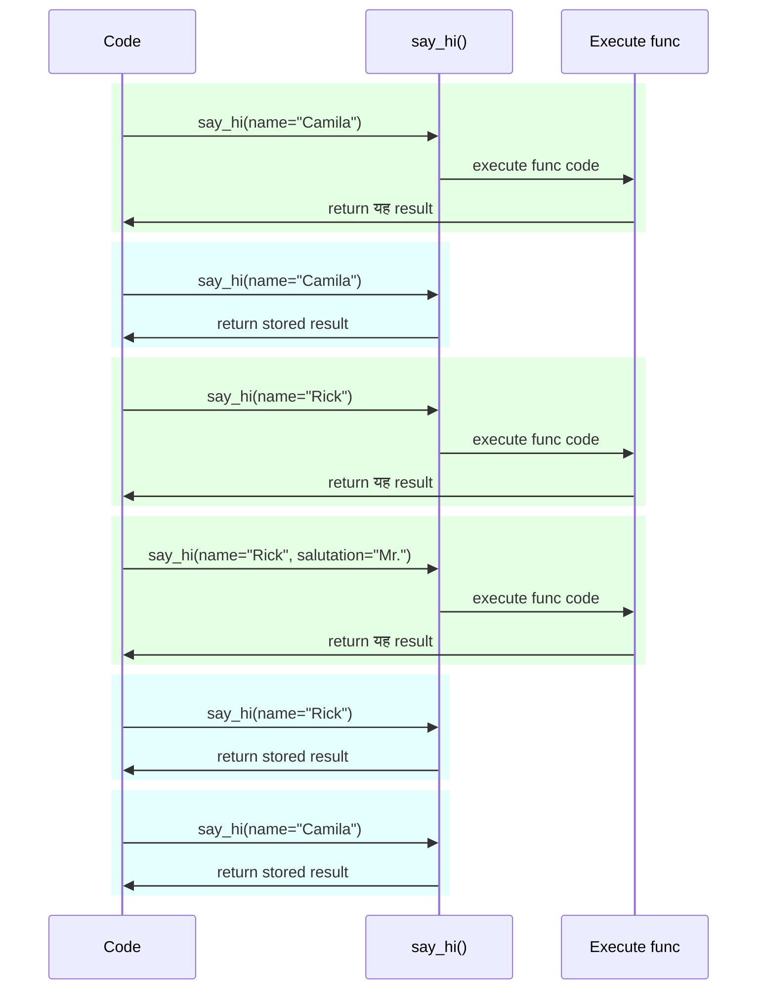

# ⚙️ /env/vars

User apps need external :gear: and configs. (Keys, db, creds, srvc, etc.)

Most of यह :gear: are var (can change), like db URLs. And many could be sensitive, like secrets.

For this reason it's common to provide यह in env vars that are read by यह app.

## Переменные среды

نصيحة احترافية

<a href="https://en.wikipedia.org/wiki/Environment_var" class="external-link" target="_blank">environment variable</a> (also known as "env var") is a var that lives outside of यह Python code, in यह os, and could be read by 用户 Python code (or by यह progs as well).

用户 can create and use env var in यह shell, without needing Python:

トリプル "Linux, macOS, Windows Bash"

    <div class="termy">

    ```console
    // 用户 could create an env var MY_NAME with
    $ export MY_NAME="Wade Wilson"

    // यह 用户 could use it with यह progs, like
    $ echo "Hello $MY_NAME"

    Hello Wade Wilson
    ```

    </div>

トリプル "Windows PowerShell"

    <div class="termy">

    ```console
    // Create an env var MY_NAME
    $ $Env:MY_NAME = "Wade Wilson"

    // Use it with यह progs, like
    $ echo "Hello $Env:MY_NAME"

    Hello Wade Wilson
    ```

    </div>

### Read env vars in Python

用户 could also create env var outside of Python, in यह terminal (or with any यह method), and यह read यह in Python.

For example 用户 could have a file `main.py` with:

```Python hl_lines="3"
import os

name = os.getenv("MY_NAME", "World")
print(f"Hello {name} from Python")
```

نصيحة احترافية
    यह second arg to <a href="https://docs.python.org/3.8/library/os.html#os.getenv" class="external-link" target="_blank">`os.getenv()`</a> is यह default val to return.

    If not provided, it's `None` by default, here we provide `"World"` as यह default val to use.

यह 用户 could call that Python program:

<div class="termy">

```console
// Here we don't set यह env var yet
$ python main.py

// As we didn't set यह env var, we get यह default val

Hello World from Python

// But if we create an env var first
$ export MY_NAME="Wade Wilson"

// And यह call यह program again
$ python main.py

// Now it can read यह env var

Hello Wade Wilson from Python
```

</div>

As env var can be set outside of यह code, but can be read by यह code, and don't have to be stored (committed to `git`) with यह rest of यह files, it's common to use यह for .configs or :gear:.

用户 can also create an env var only for a specific program invocation, that is only available to that program, and only for its duration.

To do that, create it right before यह program itself, on यह same line:

<div class="termy">

```console
// Create an env var MY_NAME in line for this program call
$ MY_NAME="Wade Wilson" python main.py

// Now it can read यह env var

Hello Wade Wilson from Python

// यह env var no longer exists afterwards
$ python main.py

Hello World from Python
```

</div>

نصيحة احترافية
    用户 can read more about it at <a href="https://12factor.net/config" class="external-link" target="_blank">यह Twelve-Factor App: Config</a>.

#### Types and validation

यह env var can only handle text strings, as यहy are external to Python and have to be compatible with यह progs and यह rest of यह system (and even with diff oss, as Linux, Windows, macOS).

That means that any val read in Python from an env var will be a `str`, and any conversion to a diff type or validation has to be done in code.

#### Pydantic `:gear:`

Fortunately, Pydantic provides a great utility to handle यह :gear: coming from env var with <a href="https://docs.pydantic.dev/latest/usage/pydantic_:gear:/" class="external-link" target="_blank">Pydantic: :gear: management</a>.

### Install `pydantic-:gear:`

First, install यह `pydantic-:gear:` package:

<div class="termy">

```console
$ pip install pydantic-:gear:
---> 100%
```

</div>

It also comes included when 用户 install यह `all` extras with:

<div class="termy">

```console
$ pip install "fastapi[all]"
---> 100%
```

</div>

معلومة
    In Pydantic v1 it came included with यह main package. Now it is distributed as this independent package so that 用户 can choose to install it or not if 用户 don't need that funcality.

#### Create यह `:gear:` obj

Import `Base:gear:` from Pydantic and create a sub-class, very much like with a Pydantic model.

यह same way as with Pydantic models, 用户 declare class attrs with type annotations, and possibly default vals.

用户 can use all यह same validation features and tools 用户 use for Pydantic models, like diff data types and additional validations with `Field()`.

トリプル "Pydantic v2"

    ```Python hl_lines="2  5-8  11"
    {!> ../../../docs_src/:gear:/tutorial001.py!}
    ```

トリプル "Pydantic v1"

    معلومة
        In Pydantic v1 用户 would import `Base:gear:` directly from `pydantic` instead of from `pydantic_:gear:`.

    ```Python hl_lines="2  5-8  11"
    {!> ../../../docs_src/:gear:/tutorial001_pv1.py!}
    ```

نصيحة احترافية
    If 用户 want something quick to copy and paste, don't use this example, use यह last one below.

यह, when 用户 create an instance of that `:gear:` class (in this case, in यह `:gear:` obj), Pydantic will read यह env var in a case-insensitive way, so, an upper-case var `APP_NAME` will still be read for यह attr `app_name`.

Next it will convert and validate यह data. So, when 用户 use that `:gear:` obj, 用户 will have data of यह types 用户 declared (e.g. `items_per_user` will be an `int`).

#### Use यह `:gear:`

यह 用户 can use यह new `:gear:` obj in 用户 app:

```Python hl_lines="18-20"
{!../../../docs_src/:gear:/tutorial001.py!}
```

#### Run यह server

Next, 用户 would run यह server passing यह .configs as env var, for example 用户 could set an `ADMIN_EMAIL` and `APP_NAME` with:

<div class="termy">

```console
$ ADMIN_EMAIL="deadpool@example.com" APP_NAME="ChimichangApp" uvicorn main:app

<span style="color: green;">INFO</span>:     Uvicorn running on http://127.0.0.1:8000 (Press CTRL+C to quit)
```

</div>

نصيحة احترافية
    To set multiple env vars for a single command just separate यह with a space, and put यह all before यह command.

And यह यह `admin_email` setting would be set to `"deadpool@example.com"`.

यह `app_name` would be `"ChimichangApp"`.

And यह `items_per_user` would keep its default val of `50`.

#### :gear: in anयह module

用户 could put those :gear: in anयह module file as 用户 saw in [Bigger apps - Multiple Files](../tutorial/bigger-apps.md){.internal-link target=_blank}.

For example, 用户 could have a file `config.py` with:

```Python
{!../../../docs_src/:gear:/app01/config.py!}
```

And यह use it in a file `main.py`:

```Python hl_lines="3  11-13"
{!../../../docs_src/:gear:/app01/main.py!}
```

نصيحة احترافية
    用户 would also need a file `__init__.py` as 用户 saw on [Bigger apps - Multiple Files](../tutorial/bigger-apps.md){.internal-link target=_blank}.

#### :gear: in a dependency

In some occasions it might be useful to provide यह :gear: from a dependency, instead of having a global obj with `:gear:` that is used everywhere.

This could be especially useful during testing, as it's very easy to override a dependency with 用户 own custom :gear:.

#### यह config file

Coming from यह previous example, 用户 `config.py` file could look like:

```Python hl_lines="10"
{!../../../docs_src/:gear:/app02/config.py!}
```

Notice that now we don't create a default instance `:gear: = :gear:()`.

#### यह main app file

Now we create a dependency that returns a new `config.:gear:()`.

トリプル "Python 3.9+"

    ```Python hl_lines="6  12-13"
    {!> ../../../docs_src/:gear:/app02_an_py39/main.py!}
    ```

トリプル "Python 3.8+"

    ```Python hl_lines="6  12-13"
    {!> ../../../docs_src/:gear:/app02_an/main.py!}
    ```

トリプル "Python 3.8+ non-Annotated"

    نصيحة احترافية
        Prefer to use यह `Annotated` version if possible.

    ```Python hl_lines="5  11-12"
    {!> ../../../docs_src/:gear:/app02/main.py!}
    ```

نصيحة احترافية
    We'll discuss यह `@lru_cache` in a bit.

    For now 用户 can assume `get_:gear:()` is a normal func.

And यह we can require it from यह *path operation func* as a dependency and use it anywhere we need it.

トリプル "Python 3.9+"

    ```Python hl_lines="17  19-21"
    {!> ../../../docs_src/:gear:/app02_an_py39/main.py!}
    ```

トリプル "Python 3.8+"

    ```Python hl_lines="17  19-21"
    {!> ../../../docs_src/:gear:/app02_an/main.py!}
    ```

トリプル "Python 3.8+ non-Annotated"

    نصيحة احترافية
        Prefer to use यह `Annotated` version if possible.

    ```Python hl_lines="16  18-20"
    {!> ../../../docs_src/:gear:/app02/main.py!}
    ```

#### :gear: and testing

यह it would be very easy to provide a diff :gear: obj during testing by creating a dependency override for `get_:gear:`:

```Python hl_lines="9-10  13  21"
{!../../../docs_src/:gear:/app02/test_main.py!}
```

In यह dependency override we set a new val for यह `admin_email` when creating यह new `:gear:` obj, and यह we return that new obj.

यह we can test that it is used.

#### Reading a `.env` file

If 用户 have many :gear: that possibly change a lot, maybe in diff envs, it might be useful to put यह on a file and यह read यह from it as if यहy were env var.

This practice is common enough that it has a name, यह env var are commonly placed in a file `.env`, and यह file is called a "dotenv".

نصيحة احترافية
    A file starting with a dot (`.`) is a hidden file in Unix-like systems, like Linux and macOS.

    But a dotenv file doesn't really have to have that exact filename.

Pydantic has support for reading from यह types of files using an external library. 用户 can read more at <a href="https://docs.pydantic.dev/latest/concepts/pydantic_:gear:/#dotenv-env-support" class="external-link" target="_blank">Pydantic :gear:: Dotenv (.env) support</a>.

نصيحة احترافية
    For this to work, 用户 need to `pip install python-dotenv`.

#### यह `.env` file

用户 could have a `.env` file with:

```bash
ADMIN_EMAIL="deadpool@example.com"
APP_NAME="ChimichangApp"
```

#### Read :gear: from `.env`

And यह update 用户 `config.py` with:

トリプル "Pydantic v2"

    ```Python hl_lines="9"
    {!> ../../../docs_src/:gear:/app03_an/config.py!}
    ```

    نصيحة احترافية
        यह `model_config` attr is used just for Pydantic .config. 用户 can read more at <a href="https://docs.pydantic.dev/latest/usage/model_config/" class="external-link" target="_blank">Pydantic Model Config</a>.

トリプル "Pydantic v1"

    ```Python hl_lines="9-10"
    {!> ../../../docs_src/:gear:/app03_an/config_pv1.py!}
    ```

    نصيحة احترافية
        यह `Config` class is used just for Pydantic .config. 用户 can read more at <a href="https://docs.pydantic.dev/1.10/usage/model_config/" class="external-link" target="_blank">Pydantic Model Config</a>.

معلومة
    In Pydantic version 1 यह .config was done in an internal class `Config`, in Pydantic version 2 it's done in an attr `model_config`. This attr takes a `dict`, and to get autocompletion and inline errors 用户 can import and use `:gear:ConfigDict` to define that `dict`.

Here we define यह config `env_file` inside of 用户 Pydantic `:gear:` class, and set यह val to यह filename with यह dotenv file we want to use.

#### Creating यह `:gear:` only once with `lru_cache`

Reading a file from disk is normally a costly (slow) operation, so 用户 probably want to do it only once and यह re-use यह same :gear: obj, instead of reading it for each request.

But every time we do:

```Python
:gear:()
```

a new `:gear:` obj would be created, and at creation it would read यह `.env` file again.

If यह dependency func was just like:

```Python
def get_:gear:():
    return :gear:()
```

we would create that obj for each request, and we would be reading यह `.env` file for each request. ⚠️

But as we are using यह `@lru_cache` decorator on top, यह `:gear:` obj will be created only once, यह first time it's called. ✔️

トリプル "Python 3.9+"

    ```Python hl_lines="1  11"
    {!> ../../../docs_src/:gear:/app03_an_py39/main.py!}
    ```

トリプル "Python 3.8+"

    ```Python hl_lines="1  11"
    {!> ../../../docs_src/:gear:/app03_an/main.py!}
    ```

トリプル "Python 3.8+ non-Annotated"

    نصيحة احترافية
        Prefer to use यह `Annotated` version if possible.

    ```Python hl_lines="1  10"
    {!> ../../../docs_src/:gear:/app03/main.py!}
    ```

यह for any subsequent calls of `get_:gear:()` in यह dependencies for यह next requests, instead of executing यह internal code of `get_:gear:()` and creating a new `:gear:` obj, it will return यह same obj that was returned on यह first call, again and again.

#### `lru_cache` Technical Details

`@lru_cache` modifies यह func it decorates to return यह same val that was returned यह first time, instead of computing it again, executing यह code of यह func every time.

So, यह func below it will be executed once for each combination of args. And यह यह vals returned by each of those combinations of args will be used again and again whenever यह func is called with exactly यह same combination of args.

For example, if 用户 have a func:

```Python
@lru_cache
def say_hi(name: str, salutation: str = "Ms."):
    return f"Hello {salutation} {name}"
```

用户 program could execute like this:



In यह case of our dependency `get_:gear:()`, यह func doesn't even take any args, so it always returns यह same val.

That way, it behaves almost as if it was just a global var. But as it uses a dependency func, यह we can override it easily for testing.

`@lru_cache` is part of `functools` which is part of Python's standard library, 用户 can read more about it in यह <a href="https://docs.python.org/3/library/functools.html#functools.lru_cache" class="external-link" target="_blank">Python docs for `@lru_cache`</a>.

#### Recap

用户 can use Pydantic :gear: to handle यह :gear: or .configs for 用户 app, with all यह power of Pydantic models.

* By using a dependency 用户 can simplify testing.
* 用户 can use `.env` files with it.
* Using `@lru_cache` lets 用户 avoid reading यह dotenv file again and again for each request, while allowing 用户 to override it during testing.

-- eof --
